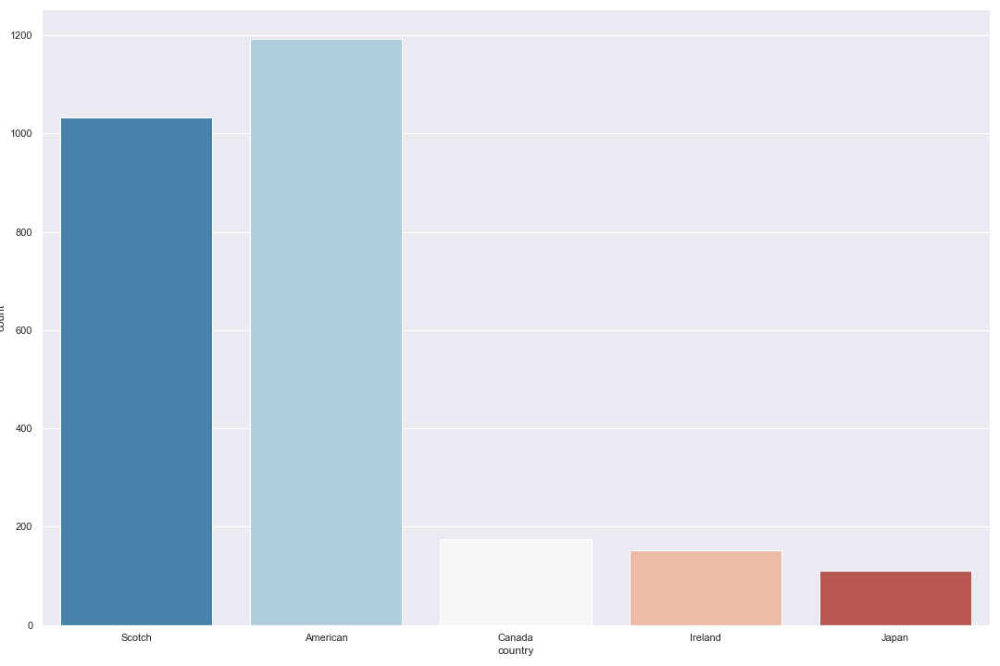
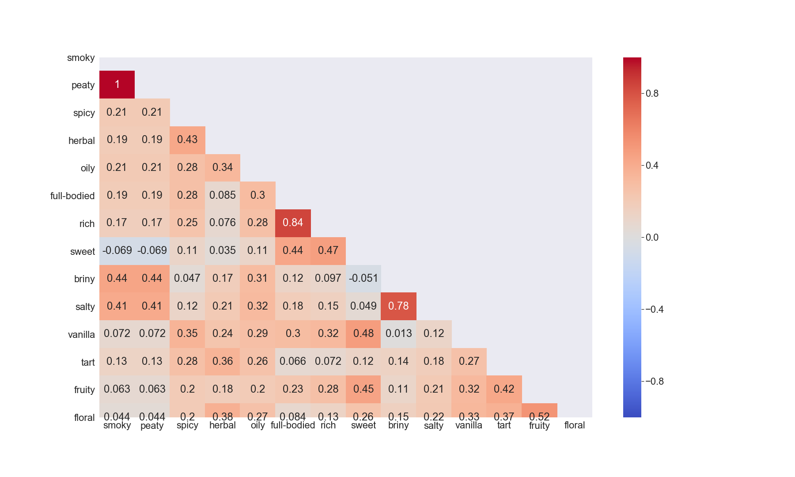
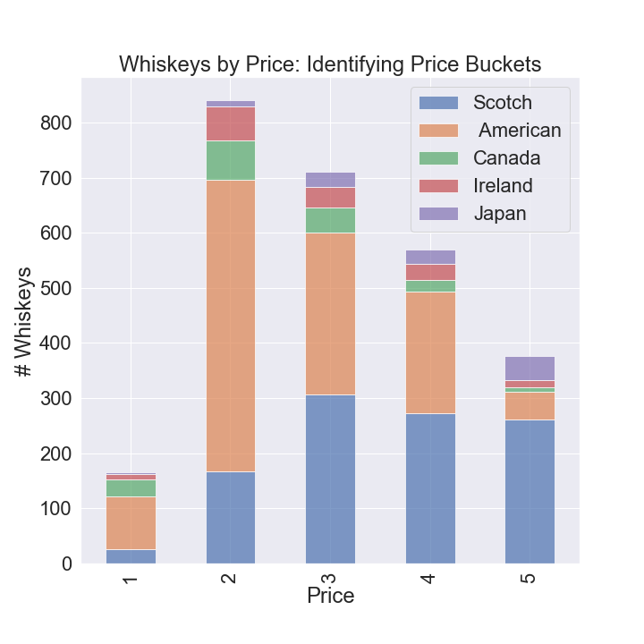
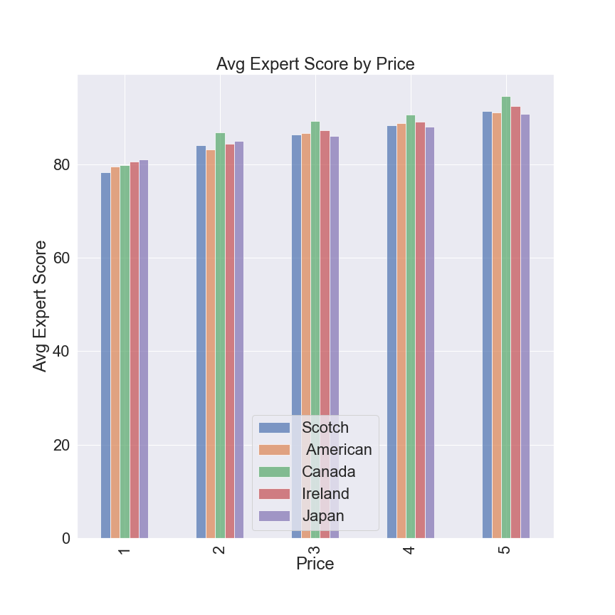
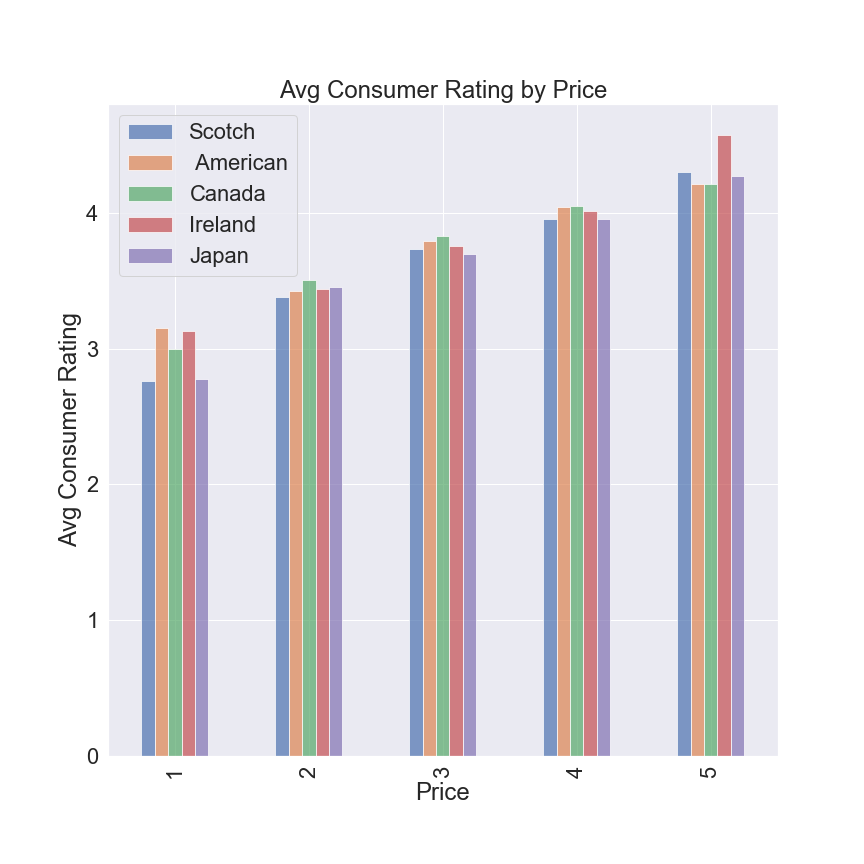

# Whiskey Sommelier
Bryan Santons, Rajeev Panwar & Maura Cerow

## Introduction

This project aims to build the first module of a comprehensive whisky recommendation engine, an **automated whisky sommelier**. We would like this to act as a go-to "middle-man" between distributors, bars and consumers.

Our target variable in our classifier model is 'country' relating to the country of origin for a given whiskey. The features used include:
  - Type (bourbon, single malt, etc)
  - Price (ranging from 1 to 5 with 5 being the most expensive)
  - Expert Score (critic score)
  - User Rating (distiller.com user reviews)
  - Age
  - ABV (Alcohol By Volume)
  - Description
  - Style (ingredients)
  - Maturing/Cask (whether matured in Oak, Sherry, etc.)
  - Flavor Profiles (each having intensity scores ranging from 0 to 100):
        - Smoky
        -  Peaty
        - Spicy
        - Herbal
        - Oily
        - Full-Bodied
        - Rich
        - Sweet
        - Briny
        - Salty
        - Vanilla
        - Tart
        - Fruity
        - Floral
  Some features we've added are - 
        - big_ticket (whiskeys that fall in the higher price point buckets)
        - poor_performance (whiskeys with a low expert score)
        - people_love_this (whiskeys that have a high user rating and are the most expensive)

The data used in this project was pulled from https://www.distiller.com. 

The questions we're answering in this model - 
  1. Can we confidently classify the country of origin given a set of features?
  2. Do we have an even distribution of data among the 5 countries we're predicting for?
  3. Does price vary depending on the country of origin?
  4. Do expert scores differ between the countries?
  5. Does the whiskey flavor profile vary from country to country?
    
The following libraries were used for this project: 

### Data Collection
  1. Requests
  2. Beautiful Soup
  3. NumPy
  4. Pandas
  5. urllib
  6. Time
  7. TQDM
  
### Data Cleaning
  1. NumPy
  2. Pandas
  
### EDA & Feature Engineering
  1. NumPy
  2. Pandas
  3. Matplotlib
  4. Seaborn
  5. Missingno
  
### Hypothesis Testing
  1. NumPy
  2. Pandas
  3. Matplotlib
  4. Seaborn
  5. OLS from Statsmodels.formula.api
  6. Statsmodels.api
  7. Pairwise_tukeyhsd from Statsmodels.stats.multicomp
  8. Multicomparison from Statsmodels.stats.multicomp
  9. Scipy.stats
  10. Scipy

### Classification Modeling Hypertuning
  1. NumPy
  2. Pandas
  3. Metrics from sklearn
  4. From sklearn.model_selection:
      - train_test_split
      - cross_val_score
      - GridSearchCV
      - StratifiedKFold
      - learning_curve
  5. From sklearn.metrics:
      - mean_squarred_error
      - r2_score
      - confusion_matrix
      - classification_report
      - f1_score
  6. LogisticRegression from sklearn.linear_model
  7. From sklearn.preprocessing:
      - StandardScaler
      - binarize
   8. KNeighborsClassifier from sklearn.neighbors
   9. From sklearn.tree:
      - DecisionTreeRegressor
      - DecisionTreeClassifier
      - export_graphviz
  10. From sklearn.ensemble:
      - RandomForestClassifier
      - AdaBoostClassifier
      - GradientBoostingClassifier
  11. LabelBinarizer from sklearn.preprocessing
  12. imblearn
  13. From imblearn.under_sampling:
      - RandomUnderSampler
      - TomekLinks
      - ClusterCentroids
   14. From imblearn.over_sampling:
      - RandomOverSampler
      - SMOTE
   15. SMOTETomek from imblearn.combine
   16. GaussianNB from sklearn.naive_bayes
   17. XGBClassifier from xgboost
   18. StringIO from sklearn.externals.six
   19. Image from IPython.display
   20. pydotplus
   21. pprint
   22. itertools
   23. Statsmodels.api
   24. OLS from statsmodels.formula.api
   25. Matplotlib
   26. Seaborn
   27. Loadtxt from NumPy
   28. Warnings

### Model Evaluation
#### TBD

In this repo, you will find the jupyter notebooks that correspond to the steps we followed when building our classifiers. The original csv for our scraped data is included, but you will find at the bottom of each notebook the code to save down a csv the dataset.

## Data Collection
*See: data_web_scraping.ipynb

For this project, we scraped data from distillery.com for the available whiskeys. The first step was to get the links for each whiskey's details. We had to browse through results with 50 results on each page and was then able to get the HREF link for each. From there, each link was appended to a list to then start the scraping process. From our list of links, we were able to parse through to get the pertinent values required for our analysis.

We were able to assemble 2,800 observations and saved as a csv to move on to the next stage.

## Data Cleaning
*See: data_cleaning.ipynb

When we got our data from distillery.com, it came through with unwanted characters, ie '\n', surrounding some of the values in our columns. Before proceeeding to EDA and later modeling, we needed to clean our data up. We removed all of the unwanted characters from the 'name' and 'price' column. Because we are setting out to predict the country of origin for a particular whiskey, we needed to determine that from the distillery location. Once we had the country, we assigned numerical values to proceed.

The country codes are:

    0 - Scotland
    1 - America
    2 - Canada
    3 - Ireland
    4 - Japan
    
The final check we wanted to make was around the 'age' column. Many of our values came in as null. Where some weren't null, they didn't have usable. Because of this, we decided to proceed without age for our current analysis.

From here we'll be working with the 'whiskey_df_clean.csv'.

## EDA & Feature Engineering
*See: eda_feature_engineering.ipynb

Before we model, we want to understand our data. The first thing to check is our target variable. See below for the distribution of our target variable.

By looking at our graph, we know we have some class imbalance. We'll want to address this when running our model.

Our EDA also includes addressing null values in the user rating columns. We don't want to lose observations here, so instead we will fill these null values by creating a weight which is our average expert score divided by the average user score. With this weight, we multiply the expert score for an observation by the weight to get a suitable user score.

We checked for correlation between the flavor profiles. We'll want to address multicollinearity and these features could potentailly explain one another.

Smoky and peaty for example and 1 for 1. We'll want to use one of these in our classifier models.

Another feature with null values is cask. We want to make the most of this column since it's instrumental in the whiskey making process. We have the 'style' column that, in some instances, tell us the cask type. We went through and pulled out the casks where we could. When we checked the number of unique values in this column, we found we had 761. Because these values are user input, we had the same value just written different ways for many of them. We created a new column called 'cask_category' to parse through and find the key words to identify the cask. After we were able to get, we created dummies for this categorical variable. We have a catch all 'other' category for any observations that didn't have a specified cask or one off value.

We wanted to check for relationships between our features. The price, expert_score & user_rating were a good place to start. When looking at the breakout of our price data, we saw that American whiskeys are more often in the lower price ranges and Scotch & Japanese whiskey are more expensive. We created the 'big_ticket' column to capture this pattern.

We checked the relationship between price and expert_score, expecting that as the price went up, so did the expert_score. Overall, American whiskeys tended to have less favorable scores, so we added another new feature 'poor_performance' to track this.

Another indication we wanted to look into was the price & user_rating. One thing that stuck out was that for the most expensive bucket, Irish whiskey was noticeably higher rated. With this insight, we added the 'people_love_this' column. 

In addition to these features, we also tracked the cask makeup of our data by country. Oak is overwhelmingly used in the whiskey making process. We then checked to see if users preferred whiskeys with a certain ABV level. There wasn't a clear indication that there was a new feature to add with these, but we will confirm they are necessary when we run our hypothesis tests in the next section.

## Hypothesis Testing

## Classifier Modeling Hypertuning

## Model Evaluation

## Conclusion & Future Steps

## Presentation

[whiskey_sommelier](https://docs.google.com/presentation/d/1ENZpW1YLgLV1PvHDEQKhzcgFzJlfmcALtxzVDWTN5C4/edit#slide=id.g73a2f809fc_2_214)
